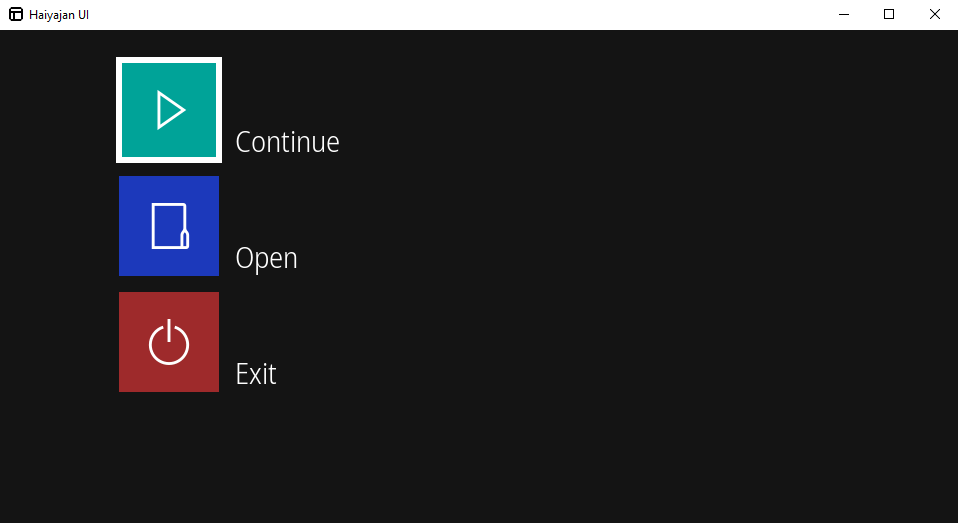

# Haiyajan UI

UI toolkit for Haiyajan. Requires the SDL2, and SDL2_ttf libraries only. Written in C99.

Simple to implement, simple to use.

This UI toolkit requires the following run-time dependencies:
- SDL2
- SDL2_ttf
  - SDL2_ttf depends upon FreeType.

And can optionally use the following run-time libraries:
- GNU Fribidi
  - Provides Unicode bidirectional text support, for languages including Hebrew and Persian.

## Building

The following tools and dependencies are required to build Haiyajan-UI.

- A C99 compatible compiler
  - Support includes GCC, Clang, and Visual Studio Build Tools\*.
- GNU Make with pkg-config, or Cmake with vcpkg
- SDL2
- SDL2_ttf
  - SDL2_ttf depends upon FreeType.

And optionally:
- GNU Fribidi

\* Visual Studio Build Tools is only supported for Windows targets. Only the latest version of Visual Studio Build Tools is supported. 

### Using CMake

This method is supported on Windows NT, and Unix-like systems such as Linux, MacOS, BSD, etc.

1. Download the latest release of [vcpkg](https://vcpkg.io/).
2. Install the required dependencies within vcpkg, making sure that the target triplet is set.
    - For example: `vcpkg install --triplet=x64-windows sdl2 sdl2-ttf fribidi`
    - Use `vcpkg help triplet` to list supported triplets.
3. Use [CMake](https://cmake.org/) to configure the project with
   `cmake -S <source directory> -B <build directory> -DCMAKE_TOOLCHAIN_FILE=<path to vcpkg>/vcpkg/scripts/buildsystems/vcpkg.cmake`
4. Start the build by executing `cmake --build <build directory>`

### Using GNU Make

This method is supported on Unix-like systems such as Linux, MacOS, BSD, etc, and Nintendo Switch.

1. Make sure that the dependecies listed above are installed.
   - On Debian for example, the following command can be executed as root to install the required dependencies: `apt-get install gcc make libsdl2-dev libsdl2-ttf-dev libfribidi-dev pkg-config`.

2. Execute GNU Make `make` in the project directory.

### Using MSBuild

These instructions are for building on Windows 8.1 and 10. The project may still be configured to support Windows XP.

This method of building Haiyajan-UI requires the use of non-free software.
As an alternative, consider using [MSYS2](https://www.msys2.org/) or [w64devkit](https://github.com/skeeto/w64devkit) with the [Using CMake](#Using CMake) instructions. 

This method requires [Visual Studio](https://visualstudio.microsoft.com/vs/). *Visual Studio 2019 Community* is free to download.
*Visual Studio Code* does not provide a Windows NT compiler, and is therefore not supported.

1. Open `./ext/MSVC/haiyajan-menu.vcxproj` within Visual Studio and build solution (Ctrl+Shift+B).

Or

This method requires [Visual Studio Build Tools](https://aka.ms/buildtools).

1. Open *Native Tools Command Prompt for VS*.

2. Execute `MSBuild -restore -p:RestorePackagesConfig=true ext\MSVC\`
   - This automatically downloads dependencies using nuget.

## License

Copyright (c) 2020 Mahyar Koshkouei 
Licensed under GNU LGPL Version 3.
