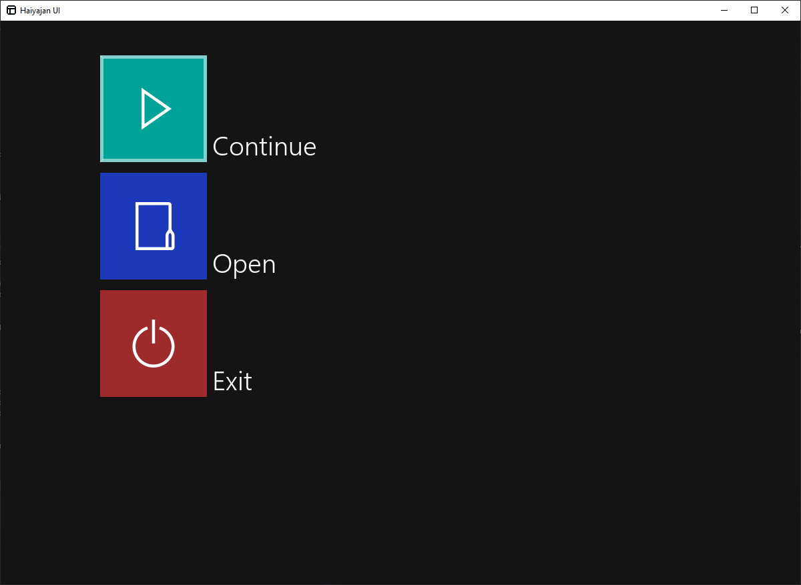

# Haiyajan UI

UI toolkit for Haiyajan. Requires the SDL2 library only. Written in C99.

Simple to implement, simple to use.

## Requirements

- A C99 compiler
- SDL2
- GNU Make

## Building

Unix: Execute GNU Make in the directory.

Windows: Execute GNU Make within the *Native Tools Command Prompt for VS*
environment to compile with Visual Studio.

## License

Copyright (c) 2020 Mahyar Koshkouei 
Licensed under GNU LGPL Version 3.
