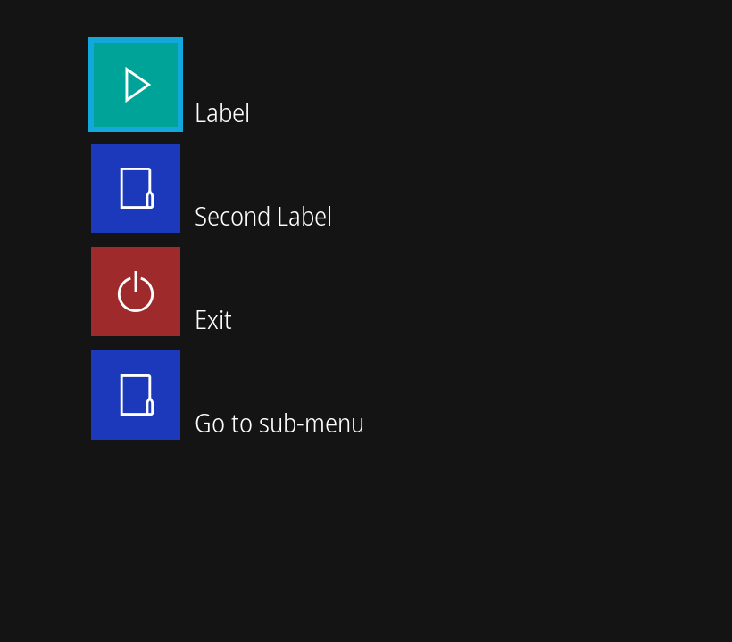

# Haiyajan UI

UI toolkit for Haiyajan. Requires the SDL2, and SDL2_ttf libraries only. Written in C99.

Simple to implement, simple to use.

This UI toolkit requires the following run-time dependencies:
- SDL2
- SDL2_ttf
  - SDL2_ttf depends upon FreeType.

And can optionally use the following run-time libraries:
- GNU Fribidi
  - Provides Unicode bidirectional text support, for languages including Hebrew and Persian.

## Building

The following tools and dependencies are required to build Haiyajan-UI.

- A C99 compatible compiler
  - Support includes GCC, Clang, and Visual Studio Build Tools\*.
- [CMake](https://cmake.org/)
  - Building for Windows NT platforms additionally requires [vcpkg](https://vcpkg.io/).
  - Other platforms will benefit with having pkg-config installed.
- [SDL2](https://www.libsdl.org/)
- [SDL2_ttf](https://www.libsdl.org/projects/SDL_ttf/)
  - SDL2_ttf depends upon FreeType.

And optionally:
- GNU Fribidi

\* Visual Studio Build Tools is only supported on for Windows targets. Only the latest version of Visual Studio Build Tools is supported. 

### Windows NT

Windows 10 is required for builds targeting Windows NT (XP, Vista, 7, 8.1, 10 and 11). It may be possible to cross-compile from a Unix-like platform, but this is not supported or recommended by this project.

The following toolchains are tested regularly:
- [Visual Studio Build Tools](https://aka.ms/buildtools)
- [w64devkit](https://github.com/skeeto/w64devkit)

#### Build using VCPKG

1. Download the latest release of [vcpkg](https://vcpkg.io/).
2. Install the required dependencies within vcpkg, making sure that the target triplet is set.
    - For example, the command `vcpkg install --triplet=x64-windows-static sdl2 sdl2-ttf fribidi` installs all dependencies for a static 64-bit build.
    - Use `vcpkg help triplet` to list supported triplets.
3. Within one of the supported toolchain environments, use CMake to configure the project with
   `cmake -S <source directory> -B <build directory> -DLIBRARY_DISCOVER_METHOD=VCPKG -DCMAKE_TOOLCHAIN_FILE=<path to vcpkg>/vcpkg/scripts/buildsystems/vcpkg.cmake`
4. Start the build by executing `cmake --build <build directory>`

#### Build using CPM

[CPM](https://github.com/cpm-cmake/CPM.cmake) is already included with the respository. However, during the build CPM will download required dependencies. See [this guide](https://github.com/cpm-cmake/CPM.cmake#cpm_source_cache) on how to cache downloaded dependencies to speed up subsequent builds.

1. Within the Visual Studio Native Tools Command Prompt, use CMake to configure the project with
   `cmake -S <source directory> -B <build directory> -DLIBRARY_DISCOVER_METHOD=CPM`
2. Start the build by executing `cmake --build <build directory>`

### Linux, MacOS, BSD, and other Unix-like

These instructions use pkg-config to link with dependencies already installed on you system. You may alternatively build using CPM by specifying `-DLIBRARY_DISCOVER_METHOD=CPM` when configuring.

1. Install the dependecies listed above.
   - On Debian for example, the following command can be executed as root to install the required dependencies: `apt-get install gcc cmake libsdl2-dev libsdl2-ttf-dev libfribidi-dev pkg-config`.
2. Use CMake to configure the project with
   `cmake -S <source directory> -B <build directory> -DLIBRARY_DISCOVER_METHOD=PKG_CONFIG`
3. Start the build by executing `cmake --build <build directory>`

### Nintendo Switch

The [devkitPro toolchain](https://devkitpro.org/wiki/Getting_Started) with devkitA64 enabled, is required.

1. Within the devkitPro environment, install the required dependencies with `pacman -S switch-cmake switch-pkg-config switch-sdl2 switch-sdl2_ttf switch-libfribidi`
2. Use CMake to configure the project with
   `cmake -S <source directory> -B <build directory> -DCMAKE_TOOLCHAIN_FILE=/opt/devkitpro/cmake/Switch.cmake`
3. Start the build by executing `cmake --build <build directory>`

### Web Browser

[Emscripten](https://emscripten.org/index.html) is required to build for modern web browsers that support [Web Assembly](https://webassembly.org/).

1. [Download and Install Emscripten](https://emscripten.org/docs/getting_started/downloads.html)
2. Within an Emscripten environment, configure the project using cmake with
    `emcmake cmake -S <source directory> -B <build directory>`
3. Start the build by executing `cmake --build <build directory>`

## License

Copyright (c) 2020-2022 Mahyar Koshkouei 
Licensed under GNU LGPL Version 3.
